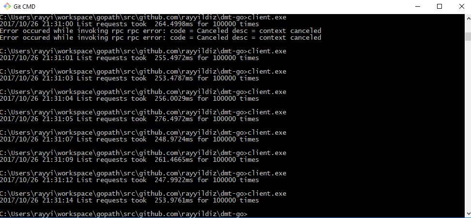

ProtoBuf
===

[](https://travis-ci.org/rayyildiz/protobuf-demo)

[Getting started with Golang](https://grpc.io/docs/quickstart/go.html)

[Go Generated Code Reference](https://grpc.io/docs/reference/go/generated-code.html) and [Go Generated Code](https://developers.google.com/protocol-buffers/docs/reference/go-generated)

[https://github.com/golang/protobuf](https://github.com/golang/protobuf)


[Language Guide (proto3)](https://developers.google.com/protocol-buffers/docs/proto3)


HelloWorld Example
---

[hello World Greater Example](https://github.com/grpc/grpc-go/blob/master/examples/helloworld/greeter_server/main.go)

```proto
syntax = "proto3";

option java_multiple_files = true;
option java_package = "io.grpc.examples.helloworld";
option java_outer_classname = "HelloWorldProto";

package helloworld;

// The greeting service definition.
service Greeter {
  // Sends a greeting
  rpc SayHello (HelloRequest) returns (HelloReply) {}
}

// The request message containing the user's name.
message HelloRequest {
  string name = 1;
}

// The response message containing the greetings
message HelloReply {
  string message = 1;
}
```


Run Example
---

If you need to generate protobuf file, just run ```make pb```. [More info](https://github.com/golang/protobuf)

Start server : ```go run server.go```

Start Client : ```go run client.go```



